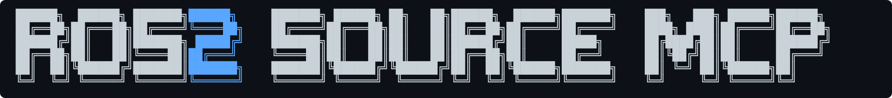

[](https://www.gnu.org/licenses/gpl-3.0)
[](https://l-reichardt.github.io/ros2-source-mcp/index/)

**What**

An MCP server that gives LLMs structured references to the ROS2 package ecosystem. Code source, metadata, dependencies, and message/service/action definitions for every package in a distribution.

**Why**

ROS2 distributions contain thousands of packages from different repositories, releases and branches. This makes finding the source difficult. Where we would refer to the official documentation index, it is not fit for agent use. This MCP provides ROS2 package information in a structured manner for LLMs.

**Note**

Implemented with Claude Code.

This is a very niche use and does not aid with general ROS2 development. It is however usefull-for limited use cases, such as spawning a subagent that checks a query package, finds other packages that use it and gathering information on  how these use certain code from it. Future development might include combining this with a ROS2 SKILL.md / subagent instructions.

**Indexed**

Information sourced from the [rosdistro index](https://github.com/ros/rosdistro). The index `.json` files are hosted in this projects [gh-page](https://l-reichardt.github.io/ros2-source-mcp/index/).

| Distro | Packages | Messages | Services | Actions |
|--------|----------|----------|----------|---------|
| Foxy | 1,060 | 1,533 | 398 | 48 |
| Galactic | 908 | 1,212 | 387 | 61 |
| Humble | 1,881 | 2,582 | 776 | 149 |
| Iron | 1,240 | 1,524 | 474 | 82 |
| Jazzy | 1,768 | 2,427 | 662 | 125 |
| Kilted | 1,498 | 2,198 | 579 | 113 |


---

<a id="top"></a>

[Install](#install) · [Tools](#tools) · [What it returns](#what-it-returns) · [Use cases](#use-cases) · [Environment variables](#environment-variables) · [Development](#development)

<a id="install"></a>

## Install

Requires [uv](https://docs.astral.sh/uv/) and Python 3.10+.

```bash
git clone https://github.com/L-Reichardt/ros2-source-mcp.git
```

Add to your `.claude/settings.json`:

```json
{
  "mcpServers": {
    "ros2-index": {
      "command": "uv",
      "args": ["run", "--project", "/path/to/ros2-source-mcp/ros2_parser", "ros2-index-mcp"]
    }
  }
}
```

Replace `/path/to` with your clone location. The server fetches the index from GitHub Pages automatically — no local index needed.

**Verify** — start a Claude Code session and ask:

> *I'm on ROS2 jazzy. What fields does sensor_msgs/Image have?*

Or add the distro version to your `CLAUDE.md / AGENTS.md`.

[back to top](#top)

---

<a id="tools"></a>

## Tools

| Tool | Purpose |
|------|---------|
| `set_distro(distro)` | Set the active distribution for the session. For LLMs: **Call first.** |
| `list_distros()` | List indexed distributions |
| `search_packages(query)` | Find packages by keyword |
| `get_package(package)` | Metadata, dependencies, and interface names |
| `get_message(package, message)` | Field definitions for a message, service, or action |

After `set_distro`, the `distro` parameter becomes optional on all other tools.

[back to top](#top)

---

<a id="what-it-returns"></a>

## What it returns

**`get_package("sensor_msgs")`** — metadata, repo URL, dependencies, interface names (not definitions):

```json
{
  "name": "sensor_msgs",
  "version": "5.3.7",
  "repo": { "url": "https://github.com/ros2/common_interfaces.git", "branch": "jazzy" },
  "dependencies": { "runtime": ["rosidl_default_runtime"], "depended_on_by": ["cv_bridge", "..."] },
  "interface_names": { "messages": ["Image", "LaserScan", "Imu", "..."], "services": ["SetCameraInfo"] }
}
```

**`get_message("sensor_msgs", "Image")`** — structured fields for code generation:

```json
{
  "kind": "message",
  "description": "This message contains an uncompressed image",
  "fields": [
    { "type": "std_msgs/Header", "name": "header" },
    { "type": "uint32", "name": "height" },
    { "type": "uint32", "name": "width" },
    { "type": "string", "name": "encoding" },
    { "type": "uint8[]", "name": "data" }
  ]
}
```

**`search_packages("laser")`** — names and descriptions, max 20 results:

```json
[
  { "name": "laser_filters", "description": "Assorted filters for laser scan data" },
  { "name": "laser_geometry", "description": "Projecting laser scans into point clouds" }
]
```

Raw `.msg` file content is stripped by default. Pass `include_raw=true` to include it.

[back to top](#top)

---

<a id="use-cases"></a>

## Use cases

| Scenario | Tools used |
|----------|-----------|
| *What fields does sensor_msgs/LaserScan have?* | `get_message` |
| *Find packages for working with cameras* | `search_packages` |
| *Resolve nested types across packages* | Chain `get_message` |
| *What do I need in package.xml to use nav2_msgs?* | `get_package` |
| *How many packages depend on tf2_msgs?* | `get_package` → `depended_on_by` |

[back to top](#top)

---

<a id="environment-variables"></a>

## Environment variables

| Variable | Default | Purpose |
|----------|---------|---------|
| `ROSINDEX_LOCAL_PATH` | — | Path to local index directory (overrides GitHub Pages) |
| `ROSINDEX_GH_ORG` | `L-Reichardt` | GitHub org for remote fetch |
| `ROSINDEX_GH_REPO` | `ros2-source-mcp` | GitHub repo for remote fetch |

[back to top](#top)

---
---

<a id="development"></a>

## Development: Building the Index

The indexer pipeline builds the JSON index from ROS2's `distribution.yaml`. This section is only relevant if you want to rebuild or extend the index.

### Setup

```bash
cd ros2_parser
uv sync --extra dev
```

To use a local index during development, set `ROSINDEX_LOCAL_PATH` in your `.claude/settings.json`:

```json
"env": { "ROSINDEX_LOCAL_PATH": "/path/to/ros2-source-mcp/ros2_parser/index" }
```

### Build

```bash
uv run ros2-indexer build --distro jazzy --keep-scratch
uv run ros2-indexer crossref --distro jazzy
```

`build` clones repos, parses package.xml and interface files, writes JSON to `ros2_parser/index/`. `crossref` adds reverse dependencies — run after build. Use `--keep-scratch` to avoid re-cloning repos between runs.

### Single package

```bash
uv run ros2-indexer build --distro jazzy --package sensor_msgs --keep-scratch
```

### Deploy

The index is not committed to `main`. After building locally, deploy to GitHub Pages:

```bash
bash scripts/deploy-index.sh
```

This pushes the contents of `ros2_parser/index/` to the `gh-pages` branch.

### Tests

```bash
uv run pytest
```

### Linting

Pre-commit hooks run ruff on every commit.

```bash
uv run ruff check .
uv run ruff format .
```

[back to top](#top)
